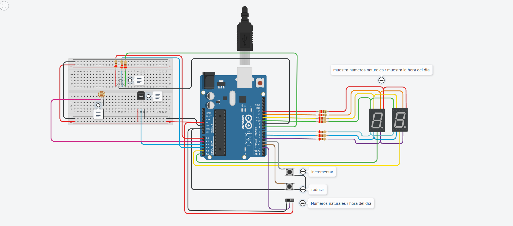

# Proyecto tercera parte

# Integrante
- Natalia Diez

# Proyecto: Incorporación de una fotorresistencia. Instalación de una luz LED RGB y ajuste de la funcionalidad del sensor de temperatura.

# Descripción
Este proyecto incluye componentes como un LED RGB, un sensor de temperatura (TMP 36), una fotorresistencia y un interruptor deslizante.
El interruptor deslizante permite alternar entre dos modos: mostrar números naturales o indicar la hora actual.
La fotorresistencia es un componente electrónico que varía su resistencia eléctrica en función de la intensidad de la luz incidente.
En este proyecto, la misma evalúa la luminosidad ambiente y afecta la visualización de la hora en los displays. A mayor luminosidad, la hora tiende a aproximarse a las 7:00, cuando sale completamente el sol.
La luz LED RGB se ajusta según las lecturas del sensor de temperatura y muestra colores diferentes: azul para el frío, amarillo para el calor moderado y rojo para el calor intenso. Se apaga al amanecer, simulando el comportamiento de las luces de la carretera que funcionan por la noche y se apagan al salir el sol (cuando la fotorresistencia llega a su punto más alto de detección de luminosidad). Esto permite a los conductores evaluar las condiciones de la carretera según la información térmica proporcionada por los LEDs.

# Funciones
## encenderSegmento
La función encenderSegmento es una función utilizada para controlar la visualización en un display de 7 segmentos. 
A través de esta función, se pueden encender o apagar segmentos específicos del display, permitiendo mostrar dígitos numéricos.

Parámetros
* "sa" posicion display A.
* "sb" posicion display B.
* "sc" posicion display C.
* "sd" posicion display D.
* "se" posicion display E.
* "sf" posicion display F.
* "sg" posicion display G.

La función toma estos parámetros y utiliza la instrucción digitalWrite para encender o apagar los pines del display de 7 segmentos correspondientes a los segmentos requeridos. Cada segmento está representado por una letra (A, B, C, D, E, F, G), y la función se encarga de establecer el estado de esos segmentos según los valores proporcionados.

~~~ C
void encenderSegmento(int sf, int sa, int sb, int sg, int se, int sd, int sc)
{
  digitalWrite(F, sf);
  digitalWrite(A, sa);
  digitalWrite(B, sb);
  digitalWrite(G, sg);
  digitalWrite(E, se);
  digitalWrite(D, sd);
  digitalWrite(C, sc);
}
~~~

## seleccionarNumero
Esta función toma un número entero como parámetro y configura el estado de los segmentos del display para representar ese número.

Parámetros
* "numero" este parámetro es un número entero que se desea mostrar en el display de 7 segmentos. 
Puede ser un valor del 0 al 9 y se utiliza para seleccionar el número que se mostrará en el display.

La función utiliza una estructura switch para determinar qué configuración de segmentos se debe aplicar para mostrar el número proporcionado.

~~~ C
void seleccionarNumero(int numero)
{
  switch(numero)
  {
    case 0:
        encenderSegmento(1,1,1,0,1,1,1); 
        break;
    case 1: 
        encenderSegmento(0,0,1,0,0,0,1); 
        break;
    case 2: 
        encenderSegmento(0,1,1,1,1,1,0); 
        break;
    case 3: 
        encenderSegmento(0,1,1,1,0,1,1); 
        break;
    case 4: 
        encenderSegmento(1,0,1,1,0,0,1); 
        break;
    case 5: 
        encenderSegmento(1,1,0,1,0,1,1); 
        break;
    case 6: 
        encenderSegmento(1,1,0,1,1,1,1); 
        break;
    case 7: 
      	encenderSegmento(0,1,1,0,0,0,1); 
        break;
    case 8:
        encenderSegmento(1,1,1,1,1,1,1); 
        break;
    case 9: 
        encenderSegmento(1,1,1,1,0,1,1); 
      break;
  }
}
~~~

## encenderDisplay
Esta función establece el encendido de los display, tanto del display de unidad como del de decena.

Parámetros
* "estadoDecena" estado del display de decenas. Puede ser 0 o 1.
* "estadoUnidades" estado del display de unidades. Puede ser 0 o 1.

Esta función muestra los números en los displays de 7 segmentos. Al controlar cuál de los dos displays está encendido en un momento dado, permite la visualización de números de dos dígitos.

~~~ C
void encenderDisplay(int estadoDecena, int estadoUnidades)
{
  digitalWrite(displayDecena, estadoDecena);
  digitalWrite(displayUnidad, estadoUnidades);
}
~~~

## mostrarNumeroEnDisplay
Esta función se encarga de mostrar un número en los display de 7 segmentos.

Parámetros
* "numero" entero que se desea mostrar en el display de 7 segmentos. Debe ser un número entre 0 y 99.

Divide el número en sus dígitos de decena y unidad, y luego activa los segmentos correspondientes en el display para representar estos dígitos en orden.

## multiplexación
En este proyecto se utiliza la técnica de la multiplexación, en la función mostrarNumeroEnDisplay, la cual combina los dos canales de información (DISPLAY_DECENA y DISPLAY_UNIDAD) utilizando un sólo medio de transmisión (a través de los mismos pines).
Cuando DISPLAY_DECENA se establece en 0, el display de las decenas se activa y se muestra la cifra correspondiente. Luego, después de un pequeño retraso (delay(10)), se cambia el estado de DISPLAY_DECENA a 1, lo que apaga el display de las decenas.
Después de mostrar la decena, el programa selecciona y muestra la unidad de manera similar, pero esta vez en el display de unidades.

## medicionTemperaturaLuzLed
Esta función determina el color del LED RGB según la temperatura en C° recibida por parámetro.

Parámetros
* "temp" entero que representa la temperatura en grados Celsius. 

Utiliza la temperatura proporcionada como parámetro para mostrar diferentes colores en la luz LED RGB.
Si la temperatura es menor a 15, la luz es verde.
Si está entre 15 y 50 la luz es amarilla.
Si es mayor a 50, la luz es roja.

~~~ C
void medicionTemperaturaLuzLed(int temp){
   if (temp <= 15){
      encenderLedRGB(0, 255, 0);
    }else if(temp < 50){
      encenderLedRGB(255, 0, 255);
    }else if(temp <= 125){
      encenderLedRGB(255, 0, 0);
    }
}
~~~

## encenderLedRGB
Función que configura un LED RGB para mostrar un color específico según los valores proporcionados.

Parámetros
* "rojo" entero que representa la intensidad del componente de color rojo.
* "azul" entero que representa la intensidad del componente de color azul.
* "verde" entero que representa la intensidad del componente de color verde.
*/

Según el valor que reciba cada parámetro, el led va a mostrarse de determinado color (rojo, amarillo, azul).

~~~ C
void encenderLedRGB(int rojo, int azul, int verde){
  analogWrite(LED_ROJO, rojo);
  analogWrite(LED_AZUL, azul);
  analogWrite(LED_VERDE, verde);
}
~~~

## calcularHoraDelDia
Función que toma lectura de una fotorresistencia y devuelve la hora del día.

Parámetros
* "lecturaFotorresistencia" entero que representa la lectura de una fotorresistencia.

Según un rango númerico basado en la lectura de la fotorresistencia, va a establecer diferentes horas que van a mostrarse en los displays.
~~~ C
int calcularHoraDelDia(int lecturaFotorresistencia){
  int hora = 0;
  if (lecturaFotorresistencia == 800){
     hora = 0;
    }else if (lecturaFotorresistencia >= 39){
      hora = 1;
    }else if (lecturaFotorresistencia >= 27){
      hora = 2;
    }else if (lecturaFotorresistencia >= 19){
      hora = 3;
    }else if (lecturaFotorresistencia >= 18){
      hora = 4;
    }else if (lecturaFotorresistencia >= 15){
      hora = 5;
    }else if (lecturaFotorresistencia >= 11){
      hora = 6;
    }else if (lecturaFotorresistencia == 10){
      hora = 7;
    }
  return hora;
}
~~~
## :robot: Link al proyecto
- [proyecto](https://www.tinkercad.com/things/4x0RfmnV6lv?sharecode=tdGhKVd1lTGxEoLLCxQJn-vvswwdHeKc9yh4ACk3Tgo)

---
### Fuentes
- [Video de la cátedra](https://www.youtube.com/watch?v=_Ry7mtURGDE&list=PL7LaR6_A2-E11BQXtypHMgWrSR-XOCeyD&index=4&t=3445s&ab_channel=UTNFRA).

- [Teoría multiplexación](https://teoriadelastelecomunicaciones.files.wordpress.com/2011/11/multiplexacion.pdf).

- [Captura de imágenes](https://www.tinkercad.com/).

- [Emojis](https://gist.github.com/rxaviers/7360908).

---

